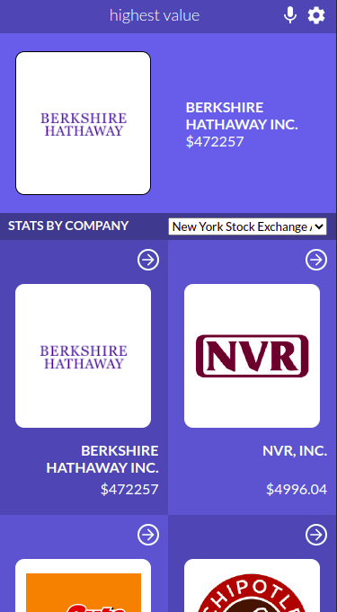

# Stock Screener

> Stock Screener SPA



This project is a stock screener SPA built as my React capstone at Microverse. Users can view stock data for selected markets and access company quotes.

It is built with React and Redux, implements the Financial Modeling Prep API, and is tested with React Testing Library and Mock Service Worker.

# Project Highlights: [view video presentation](https://www.loom.com/share/c6784590d19a48e2a37680e5aae8884a)

### - Built with React's reusability principle in mind

| `Home` component | `Symbol` component |
| -- | -- |
| https://github.com/AkashaRojee/stock-screener/blob/731015af0b7c56835964da5bba74cc9837709e3c/src/features/home/Home.js#L30-L61 | https://github.com/AkashaRojee/stock-screener/blob/731015af0b7c56835964da5bba74cc9837709e3c/src/features/details/Symbol.js#L27-L58 |

### - Uses component composition via a component I custom-built components to manage flexbox structures

| `HightlightCard` component | Reusable `SplitPane` component |
| -- | -- |
| https://github.com/AkashaRojee/stock-screener/blob/aecd51d7b0941342602c2ff0cc066d656e887269/src/common/components/HighlightCard/HighlightCard.js#L8-L32 | https://github.com/AkashaRojee/stock-screener/blob/731015af0b7c56835964da5bba74cc9837709e3c/src/common/components/SplitPane/SplitPane.js#L6-L15 https://github.com/AkashaRojee/stock-screener/blob/aecd51d7b0941342602c2ff0cc066d656e887269/src/common/components/SplitPane/SplitPaneLayout.js#L1-L8 |

### - Data fetching and loading from API is managed using thunk lifecycle actions via `createAsyncThunk`

https://github.com/AkashaRojee/stock-screener/blob/f4167e11847fa91c650eacaed60b868e3e80c2fb/src/features/home/marketSlice.js#L5-L43

### - Testing API calls is made at the network level with proper mocking using Mock Service Worker. _[View my blog post about it](https://www.akasharojee.codes/2021/09/04/testing-react-components-with-api-calls-and-redux-store.html)_.

### - Customised React Testing Library's `render` method so that tests can access real Redux store and logic and use actual app behaviour

https://github.com/AkashaRojee/stock-screener/blob/f4167e11847fa91c650eacaed60b868e3e80c2fb/src/test-utils.js#L9-L33

## Built With

- Major languages: JS, SCSS
- Others: JSX, Sass
- Libraries used: React, Redux, Mock Service Worker

## Live Demo

Please, view in mobile version: [Live Demo Link](https://AkashaRojee.github.io/stock-screener)

## Getting Started

To get a local copy up and running, follow the steps below in your terminal.

### Prerequisites

- Node.js
- npm

_For more information, <a href="https://www.akasharojee.codes/2021/06/20/intro-to-nodejs-and-npm.html" target="_blank">view the section **Installation** in this guide about Node.js and npm</a>._

### Setup

Clone the project:

```
git clone https://github.com/AkashaRojee/stock-screener.git
```

### Install

Install dependencies:

```
npm install
```

### Usage

The assets are in the `src` directory.

The output is in the `build` directory.

#### Project structure

The project is structured as feature folders with ducks slices.

```
- app //global setup and styling
- common //generic components
- features
  - /feature
    - Feature.js //main file of feature
    - featureSlice.js //feature's reducer
- mocks
```

#### Component hierarchy

```
- App
  - Header
  - Route: Home
    - HighlightCard
    - SectionTitle
    - SymbolCard(s)
  - Route: Symbols
    - HighlightCard
    - SectionTitle
    - DataRow(s)
```

### Routing implementation

#### Home page

- Upon initial render, get list of symbols from `stock` API endpoint, save into store, then display in page.
- Clicking on a symbol opens its details page.

#### Details page

- Upon initial render, get data about symbol from `quote` API endpoint, save into store, then display in page.
- Clicking on back button returns to home page.

### Deployment

**Note**: The content of the default output directory of React (`build`) is copied to `docs` upon build to facilitate publishing from GitHub Pages.

To build the website:

```
npm run build
```

To serve the website directly:

```
npm run start
```

## Author

👤 **Akasha Rojee**

- GitHub: [@AkashaRojee](https://github.com/AkashaRojee)
- Twitter: [@AkashaRojee](https://twitter.com/AkashaRojee)
- LinkedIn: [Akasha Rojee](https://linkedin.com/in/AkashaRojee)

## 🤝 Contributing

Contributions, issues, and feature requests are welcome!

<!-- Feel free to check the [issues page](/../../../issues) -->

## Show your support

Give a ⭐️ if you like this project!

## Acknowledgements

- [Financial Modeling Prep](https://financialmodelingprep.com/developer/docs/)
- [Nelson Sakwa](https://www.behance.net/gallery/31579789/Ballhead-App-(Free-PSDs))

## 📝 License

This project is [MIT](./MIT.md) licensed.
